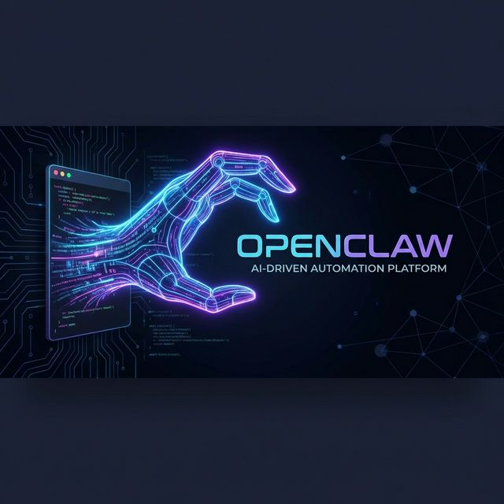

<p align="center">
  
</p>

# TripleTriple

[](https://www.python.org/downloads/)
[](https://opensource.org/licenses/MIT)

TripleTriple is a powerful, local-first AI agent gateway designed to bring advanced agentic capabilities to all your messaging channels. It provides a unified ReAct-based runtime that connects your favorite LLMs to various tools, messaging platforms, and long-term memory.

---

## 🚀 Key Features

- **🧠 Multi-Model ReAct Engine**: Native support for **OpenAI** (GPT-4o, o1), **Anthropic** (Claude 3.5), and **Google Gemini** (2.0 Flash/Pro). Features a sophisticated ReAct tool-loop for complex reasoning and action execution.
- **🔌 Multi-Channel Connectivity**: Connect once, chat everywhere. Supports **Telegram**, **Discord**, **Slack**, and **WhatsApp** with a single unified agent logic.
- **🛠️ Rich Toolset**:
  - **Bash/Terminal**: Execute commands and manage your local system.
  - **Browser**: Full web navigation and interaction via Playwright.
  - **Web Search**: Broad internet knowledge via Google/Brave.
  - **File I/O**: Read and write files securely within allowed directories.
  - **Cron**: Schedule recurring tasks and background jobs.
- **💾 Long-Term Memory**: Powered by **LanceDB**, allowing the agent to save snippets and search through them across sessions.
- **🤖 Subagent Spawning**: Spawn autonomous child agents for background tasks that report back when complete.
- **🆙 Self-Updating**: Built-in CLI and agent-triggered update mechanism (`tripletriple update`) to keep your instance current.

---

## 🛠️ Installation

1. **Clone the repository:**

   ```bash
   git clone https://github.com/dem-5on/tripletriple.git
   cd tripletriple/tripletriple
   ```

2. **Install dependencies:**

   ```bash
   pip install -e .
   ```

3. **Configure your environment:**
   Create a `.env` file based on `.env.example` and add your API keys:
   ```env
   GEMINI_API_KEY=your_key_here
   TELEGRAM_BOT_TOKEN=your_token_here
   # ... other keys
   ```

---

## 🎮 Usage

### ⚙️ Starting the Gateway

The gateway is the core control plane:

```bash
tripletriple gateway
```

### 📱 Running Channels

Start your preferred messaging bot:

```bash
tripletriple telegram
# or
tripletriple discord
```

### 🛠️ CLI Commands

TripleTriple comes with a powerful CLI for management:

```bash
tripletriple status          # Check system health
tripletriple models list     # See available LLMs
tripletriple update          # Pull latest changes and update
tripletriple version         # Show current commit and version
```

---

## 📦 Project Structure

```text
tripletriple/
├── src/tripletriple/
│   ├── agents/          # ReAct runtime and tool definitions
│   ├── channels/        # Telegram, Discord, Slack adapters
│   ├── gateway/         # FastAPI server and session management
│   ├── memory/          # Vector DB (LanceDB) integration
│   └── cli/             # Command-line interface
├── workspace/           # Agent identity, soul, and skills
└── pyproject.toml       # Build and dependency configuration
```

---

## 🛡️ Workspace & Identity

TripleTriple allows you to customize your agent's personality and knowledge via the `workspace/` directory:

- `SOUL.md`: Core personality and behavioral guidelines.
- `IDENTITY.md`: Who the agent thinks it is.
- `USER.md`: Information about you (the user) for personalized interaction.
- `skills/`: Markdown-based definitions for complex agent workflows.

---

## 🤝 Contributing

Contributions are welcome! Please feel free to submit a Pull Request.

## 📄 License

MIT License. See `LICENSE` for details.
